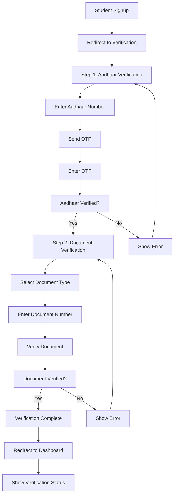

# 🔐 Digital Verification System - ScholarBEE

## 📋 Table of Contents
- [Overview](#overview)
- [Why Digital Verification?](#why-digital-verification)
- [System Architecture](#system-architecture)
- [Features](#features)
- [Technical Implementation](#technical-implementation)
- [API Documentation](#api-documentation)
- [User Flow](#user-flow)
- [Demo Instructions](#demo-instructions)
- [Security Features](#security-features)
- [Benefits](#benefits)
- [Future Enhancements](#future-enhancements)

## 🎯 Overview

The **Digital Verification System** is a comprehensive fraud prevention solution for ScholarBEE that integrates **IndiaStack APIs** (Aadhaar eKYC & DigiLocker) to verify student identities and authenticate documents. This system ensures that only genuine students with verified credentials can access scholarship opportunities.

### 🎓 Problem Statement
- **Fake Applications**: Students submitting false information
- **Document Fraud**: Forged certificates and documents
- **Identity Theft**: Using someone else's identity
- **Manual Verification**: Time-consuming and error-prone process
- **Trust Issues**: Sponsors unsure about applicant authenticity

### 💡 Solution
- **Real-time Identity Verification** using Aadhaar eKYC
- **Document Authentication** through DigiLocker APIs
- **Automated Process** reducing manual intervention
- **Government-backed Verification** ensuring authenticity
- **Seamless User Experience** with step-by-step guidance

## 🏗️ System Architecture

```
┌─────────────────┐    ┌─────────────────┐    ┌─────────────────┐
│   Frontend      │    │    Backend      │    │   IndiaStack    │
│   (React)       │◄──►│   (Node.js)     │◄──►│     APIs        │
└─────────────────┘    └─────────────────┘    └─────────────────┘
         │                       │                       │
         │                       │                       │
         ▼                       ▼                       ▼
┌─────────────────┐    ┌─────────────────┐    ┌─────────────────┐
│  User Interface │    │  Verification   │    │  Aadhaar eKYC   │
│  Components     │    │  Controller     │    │  DigiLocker     │
└─────────────────┘    └─────────────────┘    └─────────────────┘
```

## 🚀 Features

### 1. **Aadhaar eKYC Verification**
- **12-digit Aadhaar Number Validation**
  - Real-time format checking
  - Automatic digit-only input
  - Length validation (exactly 12 digits)
  
- **OTP-based Authentication**
  - SMS sent to Aadhaar-linked mobile
  - 6-digit OTP validation
  - Rate limiting to prevent abuse
  
- **Identity Data Extraction**
  - Full name verification
  - Date of birth validation
  - Gender confirmation
  - Address verification
  - Photo authentication

### 2. **DigiLocker Document Verification**
- **Multiple Document Types**
  - 10th Standard Certificate
  - 12th Standard Certificate
  - Degree/Diploma Certificate
  - Income Certificate
  
- **Document Authentication**
  - Official document number validation
  - Government database verification
  - Issuing authority confirmation
  - Document authenticity check

### 3. **User Experience Features**
- **Step-by-Step Process**
  - Clear progress indicators
  - Intuitive navigation
  - Real-time status updates
  
- **Responsive Design**
  - Mobile-first approach
  - Cross-device compatibility
  - Accessibility features
  
- **Error Handling**
  - User-friendly error messages
  - Retry mechanisms
  - Helpful guidance

## 🛠️ Technical Implementation

### Backend Architecture (Node.js + Express)

#### **Verification Controller** (`verificationController.js`)
```javascript
// Core verification functions
const verifyAadhaar = async (req, res) => {
  // 1. Validate Aadhaar number format
  // 2. Verify OTP with IndiaStack API
  // 3. Extract user data from Aadhaar
  // 4. Update user verification status
  // 5. Return verification result
};

const verifyDigiLocker = async (req, res) => {
  // 1. Validate document type and number
  // 2. Query DigiLocker API
  // 3. Verify document authenticity
  // 4. Store verification result
  // 5. Update user status
};
```

#### **Database Schema** (`userModel.js`)
```javascript
// Verification fields added to User model
verificationStatus: {
  type: String,
  enum: ['pending', 'verified', 'failed'],
  default: 'pending'
},
aadhaarNumber: String,
aadhaarVerified: Boolean,
aadhaarData: {
  name: String,
  dob: String,
  gender: String,
  address: String,
  photo: String
},
digiLockerVerified: Boolean,
digiLockerDocuments: [{
  documentType: String,
  documentNumber: String,
  verified: Boolean,
  verifiedAt: Date
}]
```

### Frontend Architecture (React + TypeScript)

#### **Main Components**
```javascript
// StudentVerification.jsx - Main verification flow
- Step 1: Aadhaar verification with OTP
- Step 2: Document verification via DigiLocker
- Progress indicators and status updates
- Error handling and user feedback

// VerificationStatus.jsx - Status display widget
- Real-time verification status
- Dashboard integration
- Quick access to verification page
```

#### **API Integration** (`api.js`)
```javascript
// Verification API methods
export const verificationAPI = {
  getStatus: () => apiRequest('/verification/status'),
  sendAadhaarOTP: (aadhaarNumber) => apiRequest('/verification/aadhaar/send-otp'),
  verifyAadhaar: (aadhaarNumber, otp) => apiRequest('/verification/aadhaar/verify'),
  verifyDigiLocker: (documentType, documentNumber) => apiRequest('/verification/digilocker/verify')
};
```

## 🔧 API Documentation

### **Aadhaar Verification Endpoints**

#### **Send OTP**
```http
POST /api/verification/aadhaar/send-otp
Content-Type: application/json
Authorization: Bearer <jwt_token>

{
  "aadhaarNumber": "123456789012"
}

Response:
{
  "success": true,
  "message": "OTP sent successfully",
  "data": {
    "otpSent": true,
    "demoOTP": "123456"
  }
}
```

#### **Verify Aadhaar**
```http
POST /api/verification/aadhaar/verify
Content-Type: application/json
Authorization: Bearer <jwt_token>

{
  "aadhaarNumber": "123456789012",
  "otp": "123456"
}

Response:
{
  "success": true,
  "message": "Aadhaar verification successful",
  "data": {
    "aadhaarVerified": true,
    "aadhaarData": {
      "name": "Rahul Kumar Sharma",
      "dob": "1998-05-15",
      "gender": "Male",
      "address": "123, Green Park, New Delhi - 110016",
      "photo": "https://via.placeholder.com/150x200/4ade80/ffffff?text=Photo"
    }
  }
}
```

### **DigiLocker Verification Endpoints**

#### **Verify Document**
```http
POST /api/verification/digilocker/verify
Content-Type: application/json
Authorization: Bearer <jwt_token>

{
  "documentType": "10th_certificate",
  "documentNumber": "CBSE123456789"
}

Response:
{
  "success": true,
  "message": "Document verification successful",
  "data": {
    "documentType": "10th_certificate",
    "verified": true,
    "documentDetails": {
      "name": "Rahul Kumar Sharma",
      "institution": "Delhi University",
      "year": "2023",
      "grade": "A+"
    }
  }
}
```

### **Status Check Endpoint**

#### **Get Verification Status**
```http
GET /api/verification/status
Authorization: Bearer <jwt_token>

Response:
{
  "success": true,
  "data": {
    "verificationStatus": "verified",
    "aadhaarVerified": true,
    "digiLockerVerified": true,
    "aadhaarData": { ... },
    "documents": [ ... ]
  }
}
```

## 📱 User Flow

### **Complete Verification Process**



### **Detailed Steps**

1. **Student Registration**
   - User completes signup form
   - System automatically redirects to verification page
   - Verification status set to 'pending'

2. **Aadhaar Verification (Step 1)**
   - User enters 12-digit Aadhaar number
   - System validates format and sends OTP
   - User enters 6-digit OTP received on mobile
   - System verifies OTP and extracts user data
   - Aadhaar verification marked as complete

3. **Document Verification (Step 2)**
   - User selects document type from dropdown
   - User enters official document number
   - System queries DigiLocker API for verification
   - Document authenticity confirmed
   - DigiLocker verification marked as complete

4. **Completion**
   - Overall verification status updated to 'verified'
   - User redirected to student dashboard
   - Verification status widget shows complete status

## 🎯 Demo Instructions

### **For Testing/Demo Purposes**

#### **Aadhaar Verification**
1. **Aadhaar Number**: Use any 12-digit number
   - Example: `123456789012`
   - Format: Only digits allowed
   - Length: Exactly 12 characters

2. **OTP**: Always use the demo OTP
   - Demo OTP: `123456`
   - Length: Exactly 6 digits
   - No real SMS will be sent

#### **Document Verification**
1. **Document Type**: Select from dropdown
   - 10th Certificate
   - 12th Certificate
   - Degree Certificate
   - Income Certificate

2. **Document Number**: Use any alphanumeric string
   - Example: `CBSE123456789`
   - Format: Any combination of letters and numbers
   - Length: No specific requirement for demo

### **Real Implementation Notes**
- Replace mock APIs with actual IndiaStack API calls
- Integrate with UIDAI Aadhaar APIs for production
- Connect to official DigiLocker APIs
- Implement proper rate limiting and security measures
- Follow UIDAI guidelines and compliance requirements

## 🛡️ Security Features

### **Authentication & Authorization**
- **JWT Token Required**: All verification endpoints require valid JWT
- **Role-based Access**: Only students can access verification
- **Session Management**: Secure token handling

### **Input Validation**
- **Aadhaar Format**: Strict 12-digit validation
- **OTP Validation**: 6-digit numeric validation
- **Document Validation**: Type and number validation
- **SQL Injection Prevention**: Parameterized queries

### **Data Protection**
- **Encrypted Storage**: Sensitive data encrypted in database
- **HTTPS Only**: All API calls use secure protocol
- **No Plain Text**: Passwords and sensitive data hashed
- **Audit Trail**: All verification attempts logged

### **Rate Limiting**
- **OTP Requests**: Limited to prevent abuse
- **API Calls**: Rate limiting on all endpoints
- **IP Blocking**: Temporary blocks for suspicious activity

## 🚀 Benefits

### **For Students**
- **Quick Verification**: Automated process saves time
- **Trust Building**: Government-verified credentials
- **Better Opportunities**: Access to more scholarships
- **Transparent Process**: Clear status updates

### **For Sponsors**
- **Fraud Prevention**: Verified student identities
- **Quality Applications**: Authentic documents
- **Reduced Risk**: Government-backed verification
- **Cost Savings**: Less manual verification needed

### **For Platform**
- **Credibility**: Official verification system
- **Scalability**: Automated process handles high volumes
- **Compliance**: Meets government standards
- **User Trust**: Enhanced platform reputation

### **For Society**
- **Reduced Fraud**: Prevents scholarship misuse
- **Fair Distribution**: Genuine students get opportunities
- **Digital India**: Promotes digital verification
- **Transparency**: Clear verification processes

## 📋 Future Enhancements

### **Advanced Verification**
- **Face Recognition**: Biometric verification
- **Video KYC**: Real-time video verification
- **Voice Authentication**: Voice-based verification
- **Fingerprint Scanning**: Biometric fingerprint verification

### **Additional Documents**
- **PAN Card**: Income verification
- **Driving License**: Address verification
- **Passport**: International student verification
- **Bank Statements**: Financial verification

### **Institutional Features**
- **Bulk Verification**: For colleges and institutions
- **API Integration**: Direct integration with institutions
- **Analytics Dashboard**: Verification statistics
- **Custom Workflows**: Institution-specific verification

### **AI & ML Integration**
- **Document OCR**: Automatic document reading
- **Fraud Detection**: AI-powered fraud detection
- **Risk Scoring**: Automated risk assessment
- **Predictive Analytics**: Verification success prediction

### **Mobile App Features**
- **Offline Verification**: Offline document verification
- **Push Notifications**: Real-time status updates
- **QR Code Scanning**: Quick document verification
- **Biometric Login**: Fingerprint/face unlock

## 🔗 Integration Points

### **Current Integrations**
- **Student Registration**: Automatic verification trigger
- **Dashboard**: Verification status display
- **Profile Management**: Verification data integration
- **Application System**: Verification status check

### **Future Integrations**
- **Admin Panel**: Verification management
- **Analytics**: Verification statistics
- **Reporting**: Verification reports
- **Third-party APIs**: Additional verification services

## 📞 Support & Documentation

### **Technical Support**
- **API Documentation**: Complete endpoint documentation
- **Error Codes**: Comprehensive error handling guide
- **Integration Guide**: Step-by-step integration instructions
- **Troubleshooting**: Common issues and solutions

### **User Support**
- **User Guide**: Complete user documentation
- **FAQ**: Frequently asked questions
- **Video Tutorials**: Step-by-step video guides
- **Help Desk**: Technical support contact

---

## 🎓 Conclusion

The **Digital Verification System** is a comprehensive solution that addresses the critical need for authentic student verification in scholarship platforms. By leveraging IndiaStack APIs, it provides a secure, scalable, and user-friendly verification process that prevents fraud while ensuring a smooth user experience.

**Key Achievements:**
- ✅ **Fraud Prevention**: Real identity and document verification
- ✅ **User Experience**: Simple, intuitive verification process
- ✅ **Scalability**: Automated system handles high volumes
- ✅ **Security**: Government-backed verification with encryption
- ✅ **Compliance**: Meets UIDAI and government standards

This system positions ScholarBEE as a trusted platform for scholarship distribution while contributing to the broader Digital India initiative.

---

**Note**: This implementation uses mock APIs for demonstration purposes. For production deployment, integrate with actual IndiaStack APIs and follow all UIDAI guidelines and compliance requirements. 